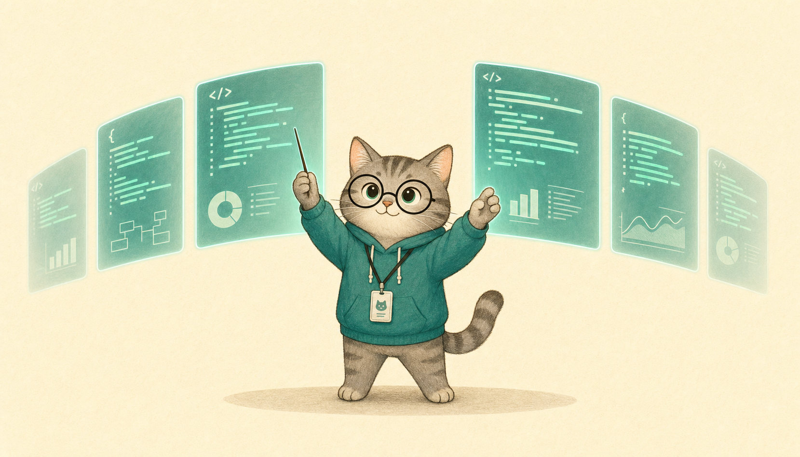
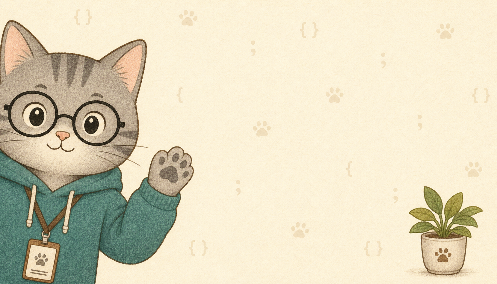

<div align="center">


[](https://git.io/typing-svg)

[](https://github.com/kimsh-1?tab=followers)
[](https://github.com/kimsh-1?tab=stars)
[](https://github.com/kimsh-1)

**I build AI pipelines that refuse to ship bad output — every skill has a hard gate, and every gate has teeth.**


</div>

---

## About me


- Building **Claude Code skills** that turn one-line intent into production-grade output
- Obsessed with **hard quality gates** — deterministic validators, graders, and refuse-to-ship checks
- Orchestrating **codex worker fleets** for mass production: images, decks, cards, corpora
- Grounding style in **measured corpora**, not vibes — if it isn't verified, it doesn't merge
- Writing in Korean, shipping for everyone

<br clear="right" />

---

## Featured builds

<div align="center">

</div>

<table>
<tr>
<td width="50%" valign="top">

### [gongnyang-prompt-kit](https://github.com/kimsh-1/gongnyang-prompt-kit)
Compiles vague asks into finished gpt-image-2 prompts — tiered negative policy, result-based description, HEX-pinned palettes, C1–C12 category playbooks, and a validator that fails loud.


[](https://github.com/kimsh-1/gongnyang-prompt-kit/stargazers)

</td>
<td width="50%" valign="top">

### [gn-voice](https://github.com/kimsh-1/gn-voice)
Rewrites AI-drafted Korean into one person's real voice — corpus-measured genre packs, a 3-axis register system, and deterministic style gates that a judge agent grades A to D.


[](https://github.com/kimsh-1/gn-voice/stargazers)

</td>
</tr>
<tr>
<td width="50%" valign="top">

### [gongnangi-chart-skill](https://github.com/kimsh-1/gongnangi-chart-skill)
McKinsey/Bain consulting-style HTML charts from a Claude Code skill — action titles, waterfall/marimekko layouts, and Chrome-rendered export.


[](https://github.com/kimsh-1/gongnangi-chart-skill/stargazers)

</td>
<td width="50%" valign="top">

### [deck-factory](https://github.com/kimsh-1/deck-factory)
One line of intent → a presentation-grade, dark-editorial HTML deck. A 90-point grader with seven hard-fail checks quietly quarantines anything below the bar.


[](https://github.com/kimsh-1/deck-factory/stargazers)

</td>
</tr>
<tr>
<td width="50%" valign="top">

### [codex-fleet](https://github.com/kimsh-1/codex-fleet)
Spawns Codex workers like a fleet — background `codex exec` orchestration with auto-scaling parallelism, race-safe output recovery, and resume-by-default batches.


[](https://github.com/kimsh-1/codex-fleet/stargazers)

</td>
<td width="50%" valign="top">

### [cardprinter](https://github.com/kimsh-1/cardprinter)
One topic → a gate-checked Instagram carousel plus a 9:16 Reels cut, fully automated — twenty physical gates between the idea and the upload button.


[](https://github.com/kimsh-1/cardprinter/stargazers)

</td>
</tr>
</table>

---

## Stack & tools

<div align="center">


</div>

---

## GitHub activity

<div align="center">

[](https://github.com/ashutosh00710/github-readme-activity-graph)


</div>

---

## Contribution snake

<div align="center">


</div>

---

## Current signal

```text
Compiling      Vague asks into production image prompts (gongnyang-prompt-kit)
Rewriting      AI-drafted Korean into a human voice (gn-voice)
Shipping       Gate-checked decks, cards, and charts (deck-factory · cardprinter · chart-skill)
Orchestrating  Codex worker fleets in parallel (codex-fleet)
```

<div align="center">



[](https://github.com/kimsh-1)


**Hard gates. Soft paws. Real output.**

</div>

<!-- 공냥이 was here -->
